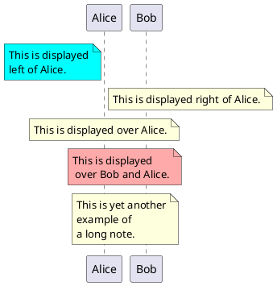

d2 가 좋다. 쉽게 사용할 수 있으니까. 다이어그램은 하나 선택해서 해야 하는데 예쁜게 좋다. 이왕이면.

-   [#템플릿: 조직모드-마크다운 내보내기 기능 검증]()


## mermaid {#mermaid}

<span class="timestamp-wrapper"><span class="timestamp">[2024-04-12 Fri 14:16]</span></span> 안전한 선택


## d2 {#d2}


### 설치 방법 {#설치-방법}

<a id="code-snippet--install-d2"></a>
```bash

# Basics
curl -fsSL https://d2lang.com/install.sh | sh -s --
```


### FIXME ob-d2 exmaples {#fixme-ob-d2-exmaples}

<span class="timestamp-wrapper"><span class="timestamp">[2023-06-16 Fri 12:54]</span></span>

<span class="timestamp-wrapper"><span class="timestamp">[2024-01-16 Tue 14:34] </span></span> 문제는 여백?! 상관 없이 블로그 엔진에서 로딩해주면 된다.

babel 검증 부터 한다. 이미지로 넣으면 되니까 Hugo 는 옵션이다.

테스트

```d2
x -> y: hello world
```

flags 옵션으로 테마 줄 수 있다. 이게 장점이기도 하다.

```d2
High Mem Instance -> EC2 <- High CPU Instance: Hosted By
```

다른 예제

```d2
clouds: {
  aws: {
    load_balancer -> api
    api -> db
  }
  gcloud: {
    auth -> db
  }

  gcloud -> aws
}
```


## plantuml {#plantuml}




## Related-Notes {#related-notes}

## References

<style>.csl-entry{text-indent: -1.5em; margin-left: 1.5em;}</style><div class="csl-bib-body">
</div>
