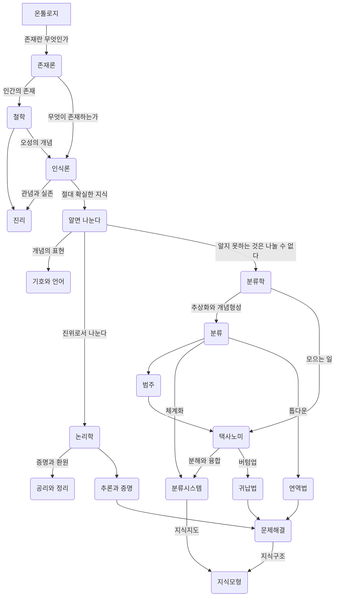

-   [온톨로지 과학자를 위한 지식그래프 (2021) - 김학래]()


## "온톨로지 알고리즘 1: 기록 정보 지식의 세계" - (타카시 사이토 2008) {#온톨로지-알고리즘-1-기록-정보-지식의-세계--타카시-사이토-2008}

-   타카시 사이토 2008 "온톨로지 알고리즘 1: 기록 정보 지식의 세계" 최석두 and 한상길


## 소개 {#소개}

기록정보학을 가로지르고, 필요불가결하며, 그것의 전통적 계승인 온톨로지 알고리즘을 재구축하는 데 목적을 두고 있는 책이다. 이 책은 온톨로지 알고리즘은 인간의 지성을 밝히는 지식 모형이며, 이것은 인간의 지적 과정의 원점이라고도 하는 "알기" 위해서 "나눈다"는 소박한 인식론에서 출발하여 역사학, 논리학, 수학, 언어학, 기호론, 분류학 등 리버럴 아츠에 의해 그 기초 원리가 확립되었다고 이야기하고 있다. 또한 컴퓨터의 출현에 따라 정보과학, 인지과학, 지식 공학, 소프트웨어 공학, 기록정보학 등 학제학의 지식 모형으로서 새롭게 연구되고 있는 온톨리지의 면면과 구조를 상세하게 밝혀내고 있다.


## 전체상 - 큰 그림을 보라! {#전체상-큰-그림을-보라}


### IT 사회 &amp; 온톨로지 알고리즘 {#it-사회-and-온톨로지-알고리즘}


### 기록 {#기록}


### 정보 {#정보}


### 관점 {#관점}


### 온톨로지 알고리즘의 발전 사이클 {#온톨로지-알고리즘의-발전-사이클}


#### 기록 사이클과 기록 알고리즘 {#기록-사이클과-기록-알고리즘}


#### 정보 사이클과 정보 알고리즘 {#정보-사이클과-정보-알고리즘}


#### 지식 사이클과 지식 알고리즘 {#지식-사이클과-지식-알고리즘}


### 주제 {#주제}


### 기록정보학 의 연구 초점 {#기록정보학-의-연구-초점}


### 정보 시스템 {#정보-시스템}


### 지식 연구 {#지식-연구}


### 온톨로지 알고리즘 &gt; 영역 {#온톨로지-알고리즘-영역}


### K-Map &amp; 재귀적 온톨로지 알고리즘 {#k-map-and-재귀적-온톨로지-알고리즘}


### 온톨로지 알고리즘 &gt; 영역 {#온톨로지-알고리즘-영역}

기초 원리
: 역사학 논리학 수사학 언어학 기호론

분류학 정보과학, 인지과학, 지식 공학, 기록정보학


## 기록 : {#기록}


### 편집 &amp; 온톨로지 알고리즘 {#편집-and-온톨로지-알고리즘}


### 책 : 편집 {#책-편집}


### 하이퍼텍스트 {#하이퍼텍스트}


#### 참조형 링크와 계층형 링크 {#참조형-링크와-계층형-링크}


#### 브라우징과 정보의 미아 {#브라우징과-정보의-미아}


#### 네비게이션 {#네비게이션}


#### World Brain {#world-brain}


#### 유사 하이퍼텍스트 {#유사-하이퍼텍스트}


#### 하이퍼텍스트 시스템 {#하이퍼텍스트-시스템}


### 아이디어 생성 {#아이디어-생성}


#### 오소링 {#오소링}


##### 구조화 편집 {#구조화-편집}


###### 주크박스형 시뮬레이션형 {#주크박스형-시뮬레이션형}


###### 노드와 링크의 규제 {#노드와-링크의-규제}


##### 정보 매핑 {#정보-매핑}


###### 인포메이션 블록의 종류 {#인포메이션-블록의-종류}


###### 하이퍼트레일 {#하이퍼트레일}


#### 라이팅 스페이스 {#라이팅-스페이스}


#### 편집공학 {#편집공학}


### 편집 &amp; 온톨로지 알고리즘 {#편집-and-온톨로지-알고리즘}

고쳐 쓰다 -&gt; 편집 드라마 &gt; 무엇인가?


### 책의 편집 {#책의-편집}

-   책의 구조 &gt; 목차 중심 =&gt; 정적 제한
-   도형
-   비선형 &gt; 참조형 관계 각주 / 주석 칼럼 기사 / 타 문서 참조)
-   문장 계층 구조
-


### 하이퍼텍스트 {#하이퍼텍스트}

원래 인간의 사고 &gt; 비선형적인 구조 책을 만드려면 선형으로 바꿔야 함.


## 정보 {#h:ec917627-7757-4b0f-81f6-d602bb06a8b7}


### 기록정보학 {#기록정보학}


### 주제 분석 {#주제-분석}


#### 색인화 {#색인화}


#### &gt; 목적 {#목적}


#### &gt; 실례 {#실례}


#### &gt; 범주 {#범주}


#### &gt; 순서 {#순서}


#### 주관적 온톨로지 {#주관적-온톨로지}


#### 속성 :and 속성값 {#속성-and-속성값}


#### 주제 분석 &gt; 연구 과제 {#주제-분석-연구-과제}


#### 상호 간의 거리 계산 {#상호-간의-거리-계산}


#### 인용 색인 {#인용-색인}


### 내용 분석 {#내용-분석}


#### 다변량 분석 {#다변량-분석}


#### 의미공간 &gt; 분석 {#의미공간-분석}


### 정보 시스템 {#정보-시스템}


#### 유니텀 {#유니텀}


#### 검색 모형 {#검색-모형}


#### 데이터베이스 관리 시스템 {#데이터베이스-관리-시스템}


#### 정보검색 시스템 {#정보검색-시스템}


### 디지털 도서관 {#디지털-도서관}


#### 도서관 모형 {#도서관-모형}


#### 메타 데이터 {#메타-데이터}


#### 정보 푸시와 정보 풀 {#정보-푸시와-정보-풀}


#### SDI 디지털 도서관 {#sdi-디지털-도서관}


#### 차분 정보 &gt; 배포 {#차분-정보-배포}


## 지식의 지식 {#지식의-지식}

지식의 뿌리 - 철학 철학 =&gt; 논리학 수학 언어학 철학의 원점 :: 온톨로지 =&gt; 사물의 속성을 나타내는 개념과 그 체계화 안다 나눈다 라는 말의 구분에서 시작.


### 철학 {#철학}

```text
고양이 이며, 그 중에서 흰 고양이가 적어도 한 마리는 존재한다.
```

:exist x (cat (x) :and white (x))

:exist 존재기호 ~이 있다, ~가 존재한다. ~가 실존한다.

```text
:exist x (cat (x) :and white (x))
$\forall$ , $\exist$
```

-   [학문이 서로 돕는다는 것 : 현상학적 학문이론과 일반체계이론의 이중주]() 여기에 좋은 주제가 들어 있다.
-   적절한 활용 방법이?!


#### 인식론 {#인식론}

-   인식하는 지성인 관념
-   대응설
-   정합설
-   실용주의

칸트 순수오성 개념 즉


#### 형이상학 {#형이상학}


#### 나눈다 &amp; 안다 {#나눈다-and-안다}


#### 분해와 종합 {#분해와-종합}


### 개념 &amp; 범주 {#개념-and-범주}


#### 개념 {#개념}


#### 외연 &amp; 내포 {#외연-and-내포}


#### 범주 {#범주}


#### 칸트 &gt; 범주 {#칸트-범주}


#### 개념 분류 {#개념-분류}


#### 개념 정의 {#개념-정의}


### 논리학 {#논리학}


#### 형식화 {#형식화}


#### 삼단논법 {#삼단논법}


#### 명제 논리 {#명제-논리}


#### 술어 논리 {#술어-논리}


#### 양화 기호 - 보편양화사 {#양화-기호-보편양화사}


#### 기호논리학 {#기호논리학}


#### 연역법 &amp; 귀납법 {#연역법-and-귀납법}


#### 논리철학 - 비트겐슈타인 {#논리철학-비트겐슈타인}


### 수학 {#수학}


#### 수학적 온톨로지 {#수학적-온톨로지}


#### 알고리즘 {#알고리즘}


### 기호론 &amp; 의미론 {#기호론-and-의미론}


#### 커뮤니케이션 모형 {#커뮤니케이션-모형}


#### 기호 &amp; 그 역할 {#기호-and-그-역할}


#### 기호 표현 &amp; 기호 내용 {#기호-표현-and-기호-내용}


#### 기호론 {#기호론}


#### 개념 형성 &amp; 의미 작용 {#개념-형성-and-의미-작용}


#### 의미론 {#의미론}


#### 표시의 &amp; 공시의 {#표시의-and-공시의}


### 언어학 &amp; 자연언어 처리 {#언어학-and-자연언어-처리}


#### 언어 모형의 작용 {#언어-모형의-작용}


#### 언어적 지식 {#언어적-지식}


#### 말 {#말}


#### 언어학 {#언어학}


#### 생성 문법 {#생성-문법}


#### 격 문법 {#격-문법}


#### 자연언어 처리 시스템 {#자연언어-처리-시스템}


##### 형태소 해석 {#형태소-해석}


##### 통어 해석 {#통어-해석}


##### 의미 해석 {#의미-해석}


##### 담화 해석 {#담화-해석}


## 분류학 :and 분류 시스템 {#분류학-and-분류-시스템}

분류학 &amp; 분류 시스템


### 생물 분류 {#생물-분류}


### 텍사노미 {#텍사노미}


### 추상화 &amp; 개념 형성 {#추상화-and-개념-형성}


### 분류 &gt; 관점 {#분류-관점}


### 분류 시스템 &gt; 탄생 {#분류-시스템-탄생}


### 도서 분류 시스템 {#도서-분류-시스템}


#### DDC {#ddc}


#### NDC {#ndc}


#### 패싯 분류 {#패싯-분류}


#### UDC {#udc}


### 시소러스 {#시소러스}


#### 시소러스 원리 {#시소러스-원리}


#### 유서 {#유서}


#### 정보검색 시스템 &gt; 시소러스 {#정보검색-시스템-시소러스}


#### 롤 &amp; 링크 {#롤-and-링크}


#### 개념 사전 {#개념-사전}


#### 의미 표현 방식 {#의미-표현-방식}


## 지식 모형 {#지식-모형}

지식 모형


### 다양한 지식 {#다양한-지식}


### 해석학 모형 {#해석학-모형}


### 정보 모형 {#정보-모형}


### 인공지능 의 지식 모형 {#인공지능-의-지식-모형}


### 지식 공학 &gt; 지식 모형 {#지식-공학-지식-모형}


### 인지과학 &gt; 지식 모형 {#인지과학-지식-모형}


### 소프트웨어 공학의 지식 모형 {#소프트웨어-공학의-지식-모형}


### 지식 관리의 지식 모형 {#지식-관리의-지식-모형}


## 지식 지도 {#지식-지도}


### 그림의 특성 {#그림의-특성}


### 프레임 모형과 의미 네트워크 {#프레임-모형과-의미-네트워크}


### 자연언어의 의미 도해 기법 {#자연언어의-의미-도해-기법}


### 소프트웨어 공학의 지식 지도 {#소프트웨어-공학의-지식-지도}


### 비지니스에서의 지식 지도 {#비지니스에서의-지식-지도}


### 검색의 지식 지도 {#검색의-지식-지도}


## 온톨로지 알고리즘의 구현 {#온톨로지-알고리즘의-구현}


### 시맨틱 웹 {#시맨틱-웹}


### 케이 에이전트 {#케이-에이전트}


### 케이 맵 {#케이-맵}


### 실험 {#실험}


### 서지 암묵지의 도구 {#서지-암묵지의-도구}


## 찾아보기 {#찾아보기}

-   1차정보


## K-map {#k-map}

지식 모형

오성 -&gt; 지성






## Related-Notes {#related-notes}

## References

<style>.csl-entry{text-indent: -1.5em; margin-left: 1.5em;}</style><div class="csl-bib-body">
  <div class="csl-entry">타카시 사이토. 2008. <i>온톨로지 알고리즘 1: 기록 정보 지식의 세계</i>. Translated by 최석두 and 한상길. 한울. <a href="https://www.yes24.com/Product/Goods/87117232">https://www.yes24.com/Product/Goods/87117232</a>.</div>
</div>
